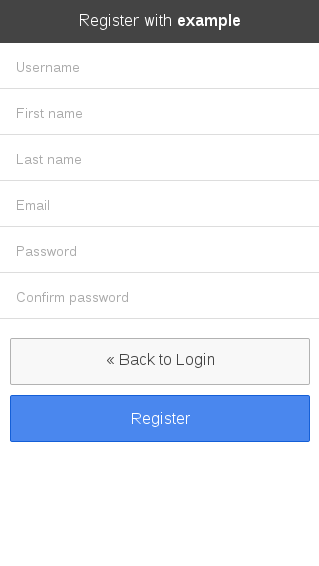

Keycloak Ionic Theme
====================

The theme is suitable as theme for http://cordova.apache.org/[Cordova] applications based on http://ionicframework.com/[Ionic framework].

image:login-screen.png[Login Screen]

How to use it
-------------

. http://keycloak.jboss.org/[Download] and extract Keycloak.
. copy `login/` directory to `{keycloak-appliance-dist-all}/keycloak/standalone/configuration/themes/`
. configure your realm to use `ionic` theme in `Settings > Social > Themes > Login Theme` in Keycloak admin

